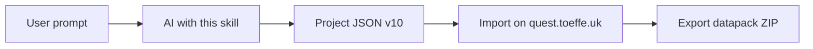

# Quest Tool MC — Generator Skill

## Overview

**Quest Tool MC** is a free browser app ([quest.toeffe.uk](https://quest.toeffe.uk)) that turns a `Project` into a Minecraft Java **1.21.11** datapack (format **94.1**). There is **no in-game "Quest Tool" item** — players use NPC proximity + `/trigger`.



### Mode detection (mandatory)

| Mode | When | What you deliver |
|------|------|------------------|
| **A — JSON (default)** | No `src/types` / `src/generator` (ChatGPT, Claude Projects, etc.) | Complete schema-**v10** Project `.json` + import steps below |
| **B — In-repo** | Working inside the Quest Tool MC git checkout | May use factories + `validateProject` + `buildDatapackZip` |

**Without Mode B you cannot call `buildDatapackZip`.** Do not claim you compiled a datapack. Emit JSON; the user imports and exports on the site.

Canonical skeleton: [project.example.json](project.example.json). Full field tables: [reference.md](reference.md).

---

## Mode A — Hand-author Project JSON

### Pipeline

```
Clone/edit project.example.json (version: 10)
  → unique ids + valid cross-refs
  → save as *.json
  → user imports on quest.toeffe.uk → fixes validation → Export datapack
```

### JSON authoring rules

| Rule | Detail |
|------|--------|
| `version` | Must be **`10`** |
| Entity `id`s | Unique strings ≈ `uid()` style (`[a-z0-9]+`, ~12 chars). Never reuse across quests/items/mobs/jobs/dims/pads |
| Cross-refs | `customItemId` / `eliteMobId` / `jobId` use those **ids**. `chain.requires` / `unlocks` use quest **names** |
| `consumeOnTurnIn` | Set **`true`** on gather/daily when items should be removed on turn-in. Omitted ⇒ keep items. Delivery always consumes |
| Required defaults | `platform`, `namespace`, `locale` (`en`\|`da`), `chain.autoStart`/`announce`, full NPC (`entityType`, `profession`, `variant`, `dialogue`, `spawnMode`) |
| Jobs | Use `"jobs": []` (import migrates starter jobs) **or** full job objects with stable `id`s if you use `requiresJob` / `jobXp` |
| Tags | NPC/`tag`, item/`tag`, mob/`tag`: lowercase `[a-z0-9_]`, unique where required |
| Output file | Prefer `{name}.json` (also valid as `quest-tool-project.json`) |
| Dialogue | Escape newlines as `\n` in JSON strings — raw newlines break generated mcfunctions |

### User import / export (tell the user this)

1. Save your output as a `.json` file.
2. Open [https://quest.toeffe.uk](https://quest.toeffe.uk).
3. **Import:** sidebar **Import project** (accepts `.json` or a datapack `.zip` containing `quest-tool-project.json`) — or **Settings → Import**.
4. Check the validation bar; fix any errors in the Editor.
5. Open **Export** → download the datapack ZIP. If custom mob skins exist, also download the resource pack.
6. In Minecraft: install pack → `/reload` (custom dimensions need a **world restart**) → `/function {namespace}:setup_guide`.

### Minimal deliverable shape

Always include at least: `id`, `name`, `namespace`, `platform`, `locale`, `version: 10`, `quests` (≥1), and arrays for `customItems`, `customMobs`, `dungeons`, `dimensions`, `teleportPads` (use `[]` if unused). See [project.example.json](project.example.json).

---

## Critical rules (both modes)

| Rule | Detail |
|------|--------|
| **IDs vs tags** | Lookups use internal **`id`**. Tags are for NBT / entity tags / `questtool_id` only |
| **Chain links** | By quest **name**, not `id` |
| **zoneCap default** | When unset at compile time: `min(max(1, amount), 5)` |
| **Silent unlock skips** | Missing job id / bad requires name may unlock in compiler; validation should catch bad chain names after import |
| **autoStart + job gate** | Disabled when next quest has `requiresJob` |
| **MC 1.21.11** | Attributes without `generic.`; `equipment:{}`; pack format 94.1 |

---

## Project shape (must know)

| Field | Role |
|-------|------|
| `namespace` | Datapack namespace (lowercase identifier) |
| `platform` | `paper` \| `vanilla` \| `lan` — money/permission commands |
| `quests` | Required (≥1) |
| `jobs` | `[]` ok (starters filled on import) or full definitions |
| `customItems` / `customMobs` | Referenced by **id** |
| `dungeons` / `dimensions` / `teleportPads` | Optional systems |
| `version` | **10** |

### Quest essentials

| Field | Notes |
|-------|-------|
| `name` | **Unique**; chain keys |
| `type` | `talk` \| `kill` \| `gather` \| `delivery` \| `exploration` \| `daily` |
| `npc` | Unique `tag`; `fixed` needs `coordinates` |
| `objectives` | Min 1 |
| `rewards` | Empty = warning only |
| `chain` | `requires`/`unlocks` by **name**; `requiresJob` by job **id** |
| `cooldownSeconds` | Daily default `86400`; else `0` |
| `targetNpc?` | Talk visit target |

### Objectives by type

| Type | Required | Notes |
|------|----------|-------|
| `kill` | `target` **or** `eliteMobId`, `amount` | Optional spawn zone + drops |
| `gather` / `daily` | `target` **or** `customItemId`, `amount` | Zone needs `zoneMob`; set `consumeOnTurnIn` |
| `delivery` | `target` **or** `customItemId`, `amount` | Always consumes |
| `exploration` | `location` | `radius` often 5; optional `dimensionId` |
| `talk` | description | No `targetNpc` → instant complete on Accept |

### Platform rewards

| Reward | paper | vanilla / lan |
|--------|-------|---------------|
| `money` | scoreboard + `eco give` | scoreboard only (warning) |
| `permission` | LuckPerms | tellraw only (warning) |
| `jobXp` / `item` / `xp` / `command` | supported | same (`{player}` → `@s`) |

### State machine (`q{index}`)

| Value | Meaning |
|-------|---------|
| `-1` | Locked |
| `0` | Available |
| `1` | Active |
| `2` | Ready to turn in |
| `3` | Done |
| `4` | Daily cooldown |

---

## Mode A workflows (JSON)

Start from [project.example.json](project.example.json). Edit names, objectives, and ids; keep cross-refs consistent.

- **Quest chain:** set `chain.unlocks` on quest A to B’s **name**; `chain.requires` on B to A’s **name**.
- **Custom item gather:** add item under `customItems` with unique `id`/`tag`; objective uses `customItemId` + `consumeOnTurnIn: true`.
- **Elite kill:** add mob under `customMobs`; objective uses `eliteMobId` (no vanilla `target` required).
- **Job gate / jobXp:** include real job objects with `id`s (not empty `jobs`) before referencing them.
- **Dimension exploration:** add dimension; set `location.dimensionId` to that dimension’s `id`. Remind user: world restart.
- **Dungeon / pads:** see [reference.md](reference.md); pair two pads for round trips.

---

## Mode B — In-repo only (TypeScript)

Only when `src/` is available. Prefer factories so defaults stay correct.

```
createProject → edit → validateProject → hasBlockingErrors?
  → buildDatapackZip (+ buildResourcePackZip if skins)
```

```typescript
// src/types/factory.ts — PROJECT_SCHEMA_VERSION = 10
createProject(name?, locale = 'da'): Project
createQuest(name?, type = 'kill', locale = 'da'): Quest
createNpc(locale = 'da'): Npc
newObjectiveFor / defaultObjectiveFor
createJob / createStarterJobs / createCustomItem / createCustomMob / createCustomMobPhase
// src/types/dimension.ts / dungeon.ts
createDimension / createTeleportPad / createDungeon / createDungeonRoom / createRoomSpawn / createRoomTrigger
// src/generator/*
buildContext / compileQuest / buildDatapackFiles / buildDatapackZip / buildResourcePackZip
validateProject / hasBlockingErrors
// src/state/projectStore.ts
renameQuestReferences / exportProjectJson / importProjectJson
// src/chain/chainGraph.ts
wouldCreateCycle / findQuestIdsInChainCycles
```

```typescript
import { validateProject, hasBlockingErrors } from '../generator/validate';
import { buildDatapackZip } from '../generator/datapack';

const issues = validateProject(project, 'en');
if (hasBlockingErrors(issues)) throw new Error(issues.map((i) => i.message).join('\n'));
const blob = await buildDatapackZip(project);
```

Unions and deeper APIs: [reference.md](reference.md). Generator tests: `src/generator/*.test.ts`.

---

## Edge cases

| Topic | Behavior |
|-------|----------|
| Spawn timer | `matches 0`, not `..0` |
| Live mob cap | All tagged mobs globally |
| Kill tracking | Non-zoned: vanilla criteria; zoned/elite: advancements |
| Chain cycles | Invalid — avoid cycles in JSON |
| Daily cooldown | `cooldownSeconds * 20` ticks |
| Resource pack | Only when custom mob skins present |

---

## Common mistakes

1. **Claiming you built a datapack ZIP in Mode A** — you only deliver JSON.
2. Omitting `version: 10` or unstable/duplicate `id`s.
3. Using `tag` instead of `id` for `customItemId` / `eliteMobId` / `jobId`.
4. Chain refs by quest `id` instead of `name`.
5. Duplicate quest names or NPC tags.
6. Kill without `target` or `eliteMobId`; spawn zone without `location`; gather zone without `zoneMob`.
7. `zoneDropMode: 'custom'` with empty `zoneDrops`.
8. Gather/daily omitting `consumeOnTurnIn: true` when removal is intended.
9. Raw newlines in dialogue strings.
10. Expecting `/reload` alone for new custom dimensions.

---

## Checklist before handing JSON to the user

- [ ] `version: 10`; `namespace`; `locale`; `platform`
- [ ] Unique quest `name`s; ≥1 valid objective each; unique NPC `tag`s
- [ ] All `customItemId` / `eliteMobId` / `jobId` refs resolve
- [ ] Chains by **name**, no cycles
- [ ] Fixed spawns have coordinates; dimensionIds exist if used
- [ ] Spawn zones / custom drops / gather `zoneMob` valid when used
- [ ] File is valid JSON; told user how to import on quest.toeffe.uk and Export

Mode B only: `validateProject` clean; then `buildDatapackZip`.

---

## Reference

- Example project: [project.example.json](project.example.json)
- Schema depth: [reference.md](reference.md)
- Live app: [https://quest.toeffe.uk](https://quest.toeffe.uk)
- Pack format: `src/generator/packFormat.ts` (1.21.11, 94.1) when in-repo
