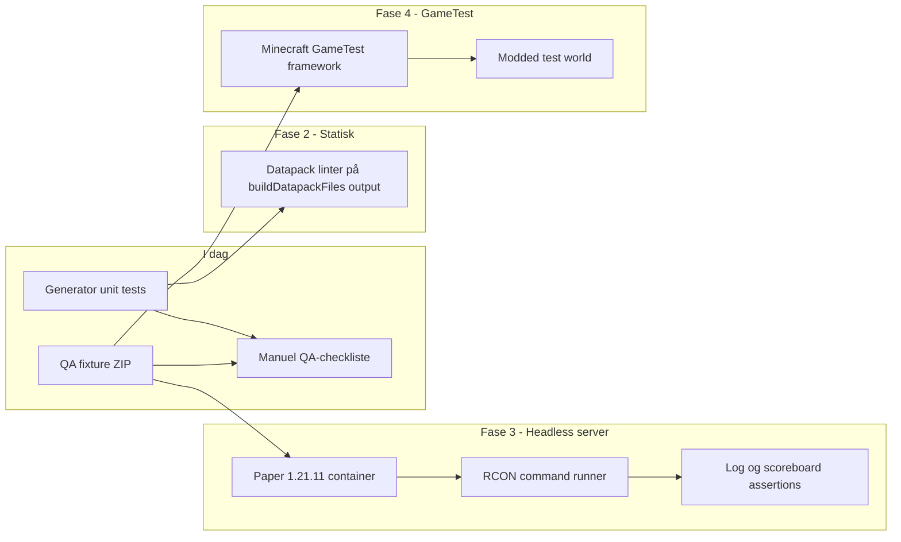

# In-game test harness (design)

> **Sprog:** [Dansk](README.da.md) · [English](README.md)

Denne mappe scaffold **runtime verification** af genererede datapacks. I dag assertér automatiserede tests kun generator output strings (`src/generator/*.test.ts`). Dette dokument beskriver, hvordan man tilføjer ægte in-game coverage uden at blokere hovedwebappens zero-server arkitektur.

## Nuværende værktøjer

| Artifact | Formål |
|----------|--------|
| [`qaProject.ts`](qaProject.ts) | Programmatisk QA-projekt (alle quest-typer + chain + custom item) |
| [`build-qa-datapack.test.ts`](build-qa-datapack.test.ts) | Vitest export test; skriver ZIP når `QA_EXPORT=1` |
| [`docs/INGAME_QA.da.md`](../../docs/INGAME_QA.da.md) | Manuel release-checkliste med `setup_guide` / `debug` |

```bash
# Verificér at fixture bygger (kører i CI via npm test)
npm test

# Skriv scripts/ingame/output/qa-suite.zip til manuel Minecraft-test
npm run ingame:fixture
```

Installér ZIP'en i en 1.21.11 verden, og følg derefter [INGAME_QA.da.md](../../docs/INGAME_QA.da.md).

## Arkitekturmuligheder



### Fase 1 — Manuel + fixture (implementeret)

- **Omkostning:** Lav
- **CI:** Fixture build valideret af Vitest; ingen Minecraft i CI
- **Værdi:** Gentagelig datapack til menneskelig QA; samme projektform ved hver release

### Fase 2 — Statisk datapack-validering

- **Omkostning:** Medium
- **Tilgang:** Efter `buildDatapackFiles()`, kør community validators på JSON/mcfunction paths (syntax, unknown keys, function path references).
- **CI:** Tilføj `npm run ingame:lint` step før build; ingen JVM påkrævet.
- **Begrænsning:** Fanger malformed filer, ikke gameplay logic.

Foreslået implementationsskitse:

```
scripts/ingame/lint-datapack.ts   # iterate FileMap, run validators
scripts/ingame/validators/        # JSON schema checks, mcfunction line rules
```

### Fase 3 — Headless Paper server (anbefalet til CI runtime)

- **Omkostning:** Høj (Docker image, startup time, flaky network i CI)
- **Tilgang:**
  1. Byg `qa-suite.zip` i CI artifact step.
  2. Start `itzg/minecraft-server` (eller custom image) pinned til **1.21.11** med Paper.
  3. Mount datapack til `/data/world/datapacks/qtqa`.
  4. Aktivér RCON; vent på "Done" i logs.
  5. Kør scripted sequence via RCON:

     ```
     /reload
     /function qtqa:spawn_all
     /function qtqa:debug
     /scoreboard players set @a q0t 0
     ```

  6. Assert log indeholder `[OK]` giver lines og ingen load errors.
  7. Valgfrit: simuler accept med trigger, assert state score changes.

Foreslået layout:

```
scripts/ingame/server/
  docker-compose.yml      # Paper 1.21.11, EULA accept, RCON password
  rcon.mjs                # send commands, read responses
  scenarios/
    smoke-load.mjs        # reload + debug only
    talk-quest.mjs        # accept talk quest, assert state 3
  run-ci.mjs              # orchestrator for GitHub Actions service container
```

**GitHub Actions skitse** (separat workflow, ikke ved hver Pages deploy):

```yaml
jobs:
  ingame-smoke:
    runs-on: ubuntu-latest
    services:
      minecraft:
        image: itzg/minecraft-server:java21
        env:
          TYPE: PAPER
          VERSION: 1.21.11
          EULA: "TRUE"
          ENABLE_RCON: "true"
          RCON_PASSWORD: test
    steps:
      - uses: actions/checkout@v4
      - run: npm ci && QA_EXPORT=1 npm run ingame:fixture
      - run: node scripts/ingame/server/scenarios/smoke-load.mjs
```

**Fordele:** Tester ægte command execution; matcher production Paper target.  
**Ulemper:** Langsom (~2–5 min), JVM i CI, vedligeholdelse når Minecraft bump minor versions.

### Fase 4 — GameTest framework

- **Omkostning:** Meget høj
- **Tilgang:** Fabric/NeoForge test mod med GameTest structures der loader den eksporterede datapack og assert entity tags, block states og function results in-world.
- **CI:** Normalt kun lokalt eller nightly; mod toolchain er tung for et statisk web app repo.
- **Fordele:** Fin-grained world assertions (mob spawn zones, loot tables).  
- **Ulemper:** Ikke aligned med vanilla datapack-only delivery; duplicate maintenance.

**Anbefaling:** Udskyd medmindre spawn-zone eller loot-table regressions bliver hyppige og Fase 3 er utilstrækkelig.

## Assertion strategy

| Adfærd | Fase 2 | Fase 3 | Manuel |
|--------|--------|--------|--------|
| pack.mcmeta valid | Ja | Ja | — |
| Function paths resolve | Delvist | Ja | — |
| Scoreboard objectives registered | — | Ja (via debug output) | Ja |
| Trigger accept / turn-in | — | Ja (RCON + trigger) | Ja |
| Job XP / advancements | — | Delvist | Ja |
| Custom item NBT | Delvist | Ja (`/give` + clear) | Ja |

## Namespace convention

QA fixture bruger namespace **`qtqa`**. Server scripts bør hardcode dette eller læse det fra `qaProject.ts` export for at undgå drift.

## Tilføjelse af nye scenarios

1. Udvid [`qaProject.ts`](qaProject.ts) med quest-mønsteret under test.
2. Tilføj en række til [`docs/INGAME_QA.da.md`](../../docs/INGAME_QA.da.md).
3. Når Fase 3 findes, tilføj `scripts/ingame/server/scenarios/<name>.mjs` der spejler de manuelle trin.
4. Behold generator unit tests som første forsvarslinje — runtime tests er langsommere og færre.

## Relaterede filer

- Generator tests: `src/generator/*.test.ts`
- Debug/setup functions: `src/generator/datapack.ts` (`debugFunction`, `setupGuideFunction`)
- CI unit tests: `.github/workflows/deploy.yml` (`npm test` før build)
