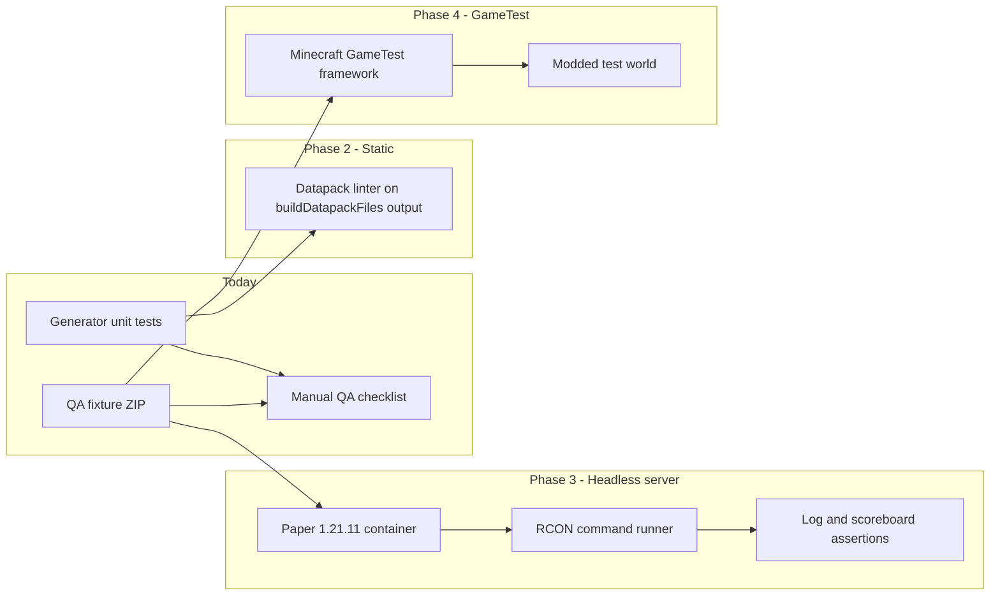

# In-Game Test Harness (Design)

> **Language:** English · [Dansk](README.da.md)

This folder scaffolds **runtime verification** of generated datapacks. Today, automated tests only assert generator output strings (`src/generator/*.test.ts`). This document describes how to add true in-game coverage without blocking the main web app's zero-server architecture.

## Current tooling

| Artifact | Purpose |
|----------|---------|
| [`qaProject.ts`](qaProject.ts) | Programmatic QA project (all quest types + chain + custom item) |
| [`build-qa-datapack.test.ts`](build-qa-datapack.test.ts) | Vitest export test; writes ZIP when `QA_EXPORT=1` |
| [`docs/INGAME_QA.md`](../../docs/INGAME_QA.md) | Manual release checklist using `setup_guide` / `debug` |

```bash
# Verify fixture builds (runs in CI via npm test)
npm test

# Write scripts/ingame/output/qa-suite.zip for manual Minecraft testing
npm run ingame:fixture
```

Install the ZIP in a 1.21.11 world, then follow [INGAME_QA.md](../../docs/INGAME_QA.md).

## Architecture options



### Phase 1 — Manual + fixture (implemented)

- **Cost:** Low
- **CI:** Fixture build validated by Vitest; no Minecraft in CI
- **Value:** Repeatable datapack for human QA; same project shape every release

### Phase 2 — Static datapack validation

- **Cost:** Medium
- **Approach:** After `buildDatapackFiles()`, run community validators on JSON/mcfunction paths (syntax, unknown keys, function path references).
- **CI:** Add `npm run ingame:lint` step before build; no JVM required.
- **Limitation:** Catches malformed files, not gameplay logic.

Suggested implementation sketch:

```
scripts/ingame/lint-datapack.ts   # iterate FileMap, run validators
scripts/ingame/validators/        # JSON schema checks, mcfunction line rules
```

### Phase 3 — Headless Paper server (recommended for CI runtime)

- **Cost:** High (Docker image, startup time, flaky network in CI)
- **Approach:**
  1. Build `qa-suite.zip` in CI artifact step.
  2. Start `itzg/minecraft-server` (or custom image) pinned to **1.21.11** with Paper.
  3. Mount datapack into `/data/world/datapacks/qtqa`.
  4. Enable RCON; wait for "Done" in logs.
  5. Run scripted sequence via RCON:

     ```
     /reload
     /function qtqa:spawn_all
     /function qtqa:debug
     /scoreboard players set @a q0t 0
     ```

  6. Assert log contains `[OK]` giver lines and no load errors.
  7. Optional: simulate accept with trigger, assert state score changes.

Suggested layout:

```
scripts/ingame/server/
  docker-compose.yml      # Paper 1.21.11, EULA accept, RCON password
  rcon.mjs                # send commands, read responses
  scenarios/
    smoke-load.mjs        # reload + debug only
    talk-quest.mjs        # accept talk quest, assert state 3
  run-ci.mjs              # orchestrator for GitHub Actions service container
```

**GitHub Actions sketch** (separate workflow, not on every Pages deploy):

```yaml
jobs:
  ingame-smoke:
    runs-on: ubuntu-latest
    services:
      minecraft:
        image: itzg/minecraft-server:java21
        env:
          TYPE: PAPER
          VERSION: 1.21.11
          EULA: "TRUE"
          ENABLE_RCON: "true"
          RCON_PASSWORD: test
    steps:
      - uses: actions/checkout@v4
      - run: npm ci && QA_EXPORT=1 npm run ingame:fixture
      - run: node scripts/ingame/server/scenarios/smoke-load.mjs
```

**Pros:** Tests real command execution; matches production Paper target.  
**Cons:** Slow (~2–5 min), JVM in CI, maintenance when Minecraft bumps minor versions.

### Phase 4 — GameTest framework

- **Cost:** Very high
- **Approach:** Fabric/NeoForge test mod with GameTest structures that load the exported datapack and assert entity tags, block states, and function results in-world.
- **CI:** Usually local or nightly only; mod toolchain is heavy for a static web app repo.
- **Pros:** Fine-grained world assertions (mob spawn zones, loot tables).  
- **Cons:** Not aligned with vanilla datapack-only delivery; duplicate maintenance.

**Recommendation:** Defer unless spawn-zone or loot-table regressions become frequent and Phase 3 is insufficient.

## Assertion strategy

| Behavior | Phase 2 | Phase 3 | Manual |
|----------|---------|---------|--------|
| pack.mcmeta valid | Yes | Yes | — |
| Function paths resolve | Partial | Yes | — |
| Scoreboard objectives registered | — | Yes (via debug output) | Yes |
| Trigger accept / turn-in | — | Yes (RCON + trigger) | Yes |
| Job XP / advancements | — | Partial | Yes |
| Custom item NBT | Partial | Yes (`/give` + clear) | Yes |

## Namespace convention

The QA fixture uses namespace **`qtqa`**. Server scripts should hardcode this or read it from `qaProject.ts` export to avoid drift.

## Adding new scenarios

1. Extend [`qaProject.ts`](qaProject.ts) with the quest pattern under test.
2. Add a row to [`docs/INGAME_QA.md`](../../docs/INGAME_QA.md).
3. When Phase 3 exists, add `scripts/ingame/server/scenarios/<name>.mjs` mirroring the manual steps.
4. Keep generator unit tests as the first line of defense — runtime tests are slower and fewer.

## Related files

- Generator tests: `src/generator/*.test.ts`
- Debug/setup functions: `src/generator/datapack.ts` (`debugFunction`, `setupGuideFunction`)
- CI unit tests: `.github/workflows/deploy.yml` (`npm test` before build)
